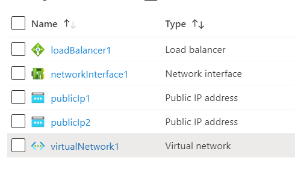

# Terraform: 101-loadbalancer-with-multivip 
## Load Balancer with 2 VIPs and LB rules
## Description
This is a conversion of ARM template *[101-loadbalancer-with-multivip](https://github.com/Azure/azure-quickstart-templates/tree/master/101-loadbalancer-with-multivip)* from the repository *[azure\azure-quickstart-templates](https://github.com/Azure/azure-quickstart-templates)* to Terraform configuration.

This configuration allows you to create a Load Balancer, 2 Public IP addresses for the Load balancer, Virtual Network, Network Interface in the Virtual Network. Each VIP is associated to a LB rule that is used by the Network Interface. See https://azure.microsoft.com/en-us/documentation/articles/load-balancer-multivip/ for documentation.

This configutation will deploy the following resources…



> ### Note:
> If there is already the specified resource group exists then the script will not continue with the deployment. If you want to deploy the resources to the existing resource group, then import the resource group to state before deployment.

### Syntax
```
# To initialize the configuration directory
PS C:\Terraform\101-loadbalancer-with-multivip> terraform init 

# To check the execution plan
PS C:\Terraform\101-loadbalancer-with-multivip> terraform plan

# To deploy the configuration
PS C:\Terraform\101-loadbalancer-with-multivip> terraform apply
```  

### Example
```
PS C:\Terraform\101-loadbalancer-with-multivip> terraform init 
PS C:\Terraform\101-loadbalancer-with-multivip> terraform plan
PS C:\Terraform\101-loadbalancer-with-multivip> terraform apply 
```


### Output

```
azurerm_resource_group.arg-01: Creating...
azurerm_resource_group.arg-01: Creation complete after 3s 
azurerm_lb.alb-01: Still creating... [10s elapsed]

<--- output truncated --->

azurerm_lb_rule.albrule-01: Creation complete after 7s 

Apply complete! Resources: 12 added, 0 changed, 0 destroyed
```
>Azure Cloud Shelll comes with terraform pre-installed and you deploy this configuration in Cloud Shell as well.
>
>[](https://shell.azure.com)