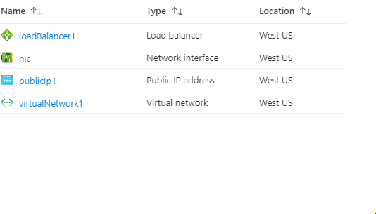

# Terraform: 101-loadbalancer-with-nat-rule 
## Load Balancer with Inbound NAT Rule
## Description
This is a conversion of ARM template *[101-loadbalancer-with-nat-rule](https://github.com/Azure/azure-quickstart-templates/tree/master/101-loadbalancer-with-nat-rule)* from the repository *[azure\azure-quickstart-templates](https://github.com/Azure/azure-quickstart-templates)* to Terraform configuration.

This configuration allows you to create a Load Balancer, Public IP address for the Load balancer, Virtual Network, Network Interface in the Virtual Network & a NAT Rule in the Load Balancer that is used by the Network Interface.

This configuration will deploy the following  resources…



> ### Note:
> If there is already the specified resource group exists then the script will not continue with the deployment. If you want to deploy the resources to the existing resource group, then import the resource group to state before deployment.

### Syntax
```
# To initialize the configuration directory
PS C:\Terraform\101-loadbalancer-with-nat-rule> terraform init 

# To check the execution plan
PS C:\Terraform\101-loadbalancer-with-nat-rule> terraform plan

# To deploy the configuration
PS C:\Terraform\101-loadbalancer-with-nat-rule> terraform apply
```  

### Example
```
PS C:\Terraform\101-loadbalancer-with-nat-rule> terraform init 
PS C:\Terraform\101-loadbalancer-with-nat-rule> terraform plan

<--- output truncated --->

PS C:\Terraform\101-loadbalancer-with-nat-rule> terraform apply 

```
### Output

```
azurerm_resource_group.arg-01: Creating...
azurerm_resource_group.arg-01: Creation complete after 1s
azurerm_virtual_network.avn-01: Creating...
azurerm_public_ip.apip-01: Creating...

<--- output truncated --->

azurerm_network_interface_nat_rule_association.anna-01: Creation complete after 1s 

Apply complete! Resources: 10 added, 0 changed, 0 destroyed.
```

>Azure Cloud Shelll comes with terraform pre-installed and you deploy this configuration in Cloud Shell as well.
>
>[](https://shell.azure.com)
