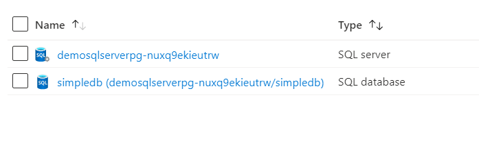

# Terraform: 101-sql-database
## Azure SQL Database
## Description

This is a conversion of ARM template *[101-sql-database](https://github.com/Azure/azure-quickstart-templates/tree/master/101-sql-database)* from the repository *[azure\azure-quickstart-templates](https://github.com/Azure/azure-quickstart-templates)* to Terraform configuration, and this configuration will deploy following the resources…



> ### Note:
> If the specified resource group is already exist then the script will not continue with the deployment. If you want to deploy the resources to the existing resource group, then import the resource group to state before deployment.

### Syntax
```
# To initialize the configuration directory
PS C:\Terraform\101-sql-database> terraform init 

# To check the execution plan
PS C:\Terraform\101-sql-database> terraform plan

# To deploy the configuration
PS C:\Terraform\101-sql-database> terraform apply
```  

### Example
```
PS C:\Terraform\101-1vm-2nics-2subnets-1vnet> terraform init 
PS C:\Terraform\101-1vm-2nics-2subnets-1vnet> terraform plan

  var.SQLServer
  The name of the SQL logical server.
  Enter a value: demosqlserver

  var.administratorLoginPassword
  The administrator password of the SQL logical server.
  Enter a value: ******

<--- output truncated --->

PS C:\Terraform\101-1vm-2nics-2subnets-1vnet> terraform apply 

  var.SQLServer
  The name of the SQL logical server.
  Enter a value: demosqlserver

  var.administratorLoginPassword
  The administrator password of the SQL logical server.
  Enter a value: ******
```

### Output

```
azurerm_sql_server.SQL-Ser-01: Still creating..

<--- output truncated --->

azurerm_sql_database.SQL-Db-01: Creation complete after 1m13s

Apply complete! Resources: 3 added, 0 changed, 0 destroyed.
```

>Azure Cloud Shelll comes with terraform pre-installed and you deploy this configuration in Cloud Shell as well.
>
>[](https://shell.azure.com)