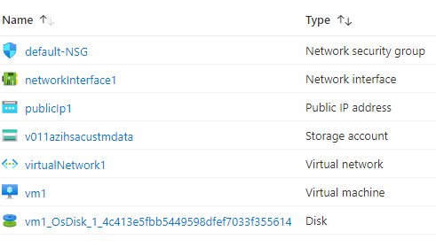

# Terraform: 101-vm-customdata
## Deploy a Virtual Machine with CustomData
## Description 
This is a conversion of ARM template *[101-vm-customdata](https://github.com/Azure/azure-quickstart-templates/tree/master/101-vm-customdata)* from the repository *[azure\azure-quickstart-templates](https://github.com/Azure/azure-quickstart-templates)* to Terraform configuration.

This configuration allows you to create a Virtual Machine with Custom Data. This template also deploys a Storage Account, Virtual Network, Public IP addresses and a Network Interface, and it will deploy the following resources...



You can verify the Custom Data in the file /var/lib/cloud/instance/user-data.txt

> ### Note:
> If the specified resource group is already exist then the script will not continue with the deployment. If you want to deploy the resources to the existing resource group, then import the resource group to state before deployment.

### Syntax
```
# To initialize the configuration directory
PS C:\Terraform\101-vm-customdata> terraform init 

# To check the execution plan
PS C:\Terraform\101-vm-customdata> terraform plan

# To deploy the configuration
PS C:\Terraform\101-vm-customdata> terraform apply
```

### Example
```
# Initialize
PS C:\Terraform\101-vm-customdata> terraform init 

# Plan
PS C:\Terraform\101-vm-customdata> terraform plan -var="adminUsername=cloudguy" 

var.adminPassword
The admin password of the VM.
Enter a value: *********

<--- output truncated --->

# Apply
PS C:\Terraform\101-vm-customdata> terraform apply -var="adminUsername=cloudguy" 

var.adminPassword
The admin password of the VM.
Enter a value: *********
```
## Output
```
azurerm_resource_group.arg-01: Creating...
azurerm_resource_group.arg-01: Creation complete after 2s 
azurerm_virtual_network.avn-01: Creating...

<--- output truncated --->

azurerm_linux_virtual_machine.avm-ssh-01: Still creating... [1m30s elapsed]
azurerm_linux_virtual_machine.avm-ssh-01: Creation complete after 1m39s 

Apply complete! Resources: 10 added, 0 changed, 0 destroyed.
```

> Azure Cloud Shell comes with Azure PowerShell pre-installed and you can deploy the above resources using Cloud Shell as well.
>
>[](https://shell.azure.com)
