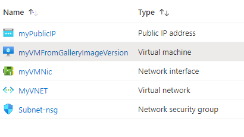

# Terraform: 101-vm-from-sig

## Create Virtual Machine from a Shared Image Gallery

## Description 

This is an Azure quickstart sample terraform configuration based on ARM template *[101-vm-from-sig](https://github.com/Azure/azure-quickstart-templates/tree/master/101-vm-from-sig)* from the repository *[azure\azure-quickstart-templates](https://github.com/Azure/azure-quickstart-templates)*.

This configuration creates a Virtual Machine from an Image Version in a Shared Image Gallery. Please ensure you have already deployed the 101 templates to create Shared Image Gallery, Image Definition, and Image Version, and it will deploy the following resources..



> ### Note:
> If the specified resource group is already exist then the script will not continue with the deployment. If you want to deploy the resources to the existing resource group, then import the resource group to state before deployment.

### Syntax
```
# To initialize the configuration directory
PS C:\Terraform\101-vm-from-sig> terraform init 

# To check the execution plan
PS C:\Terraform\101-vm-from-sig> terraform plan

# To deploy the configuration
PS C:\Terraform\101-vm-from-sig> terraform apply
```

### Example
```
# Initialize
PS C:\Terraform\101-vm-from-sig> terraform init 

# Plan
PS C:\Terraform\101-vm-from-sig> terraform plan

var.adminUsername
User name for the Virtual Machine.
Enter a value: cloudguy

var.adminPassword
The admin password of the VM.
Enter a value: *********

<--- output truncated --->

# Apply
PS C:\Terraform\101-vm-from-sig> terraform apply

var.adminUsername
User name for the Virtual Machine.
Enter a value: cloudguy

var.adminPassword
The admin password of the VM.
Enter a value: *********

```
## Output
```
data.azurerm_shared_image_version.asgi: Refreshing state...
azurerm_resource_group.arg-01: Creating...
azurerm_resource_group.arg-01: Creation complete after 1s

<--- output truncated --->

azurerm_linux_virtual_machine.avm-ssh-01[0]: Still creating... [1m40s elapsed]
azurerm_linux_virtual_machine.avm-ssh-01[0]: Creation complete after 1m40s 

Apply complete! Resources: 8 added, 0 changed, 0 destroyed.

Outputs:

hostname = demodnssep.westus.cloudapp.azure.com
```

> Azure Cloud Shell comes with Azure PowerShell pre-installed and you can deploy the above resources using Cloud Shell as well.
>
>[](https://shell.azure.com)
