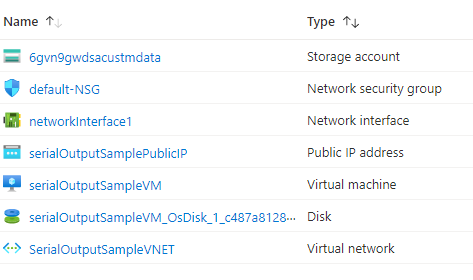

# Terraform: 101-vm-linux-serial-output

## Simple Linux VM created with serial/console output configured 

## Description
This is a conversion of ARM template *[101-vm-linux-serial-output](https://github.com/Azure/azure-quickstart-templates/tree/master/101-vm-linux-serial-output)* from the repository *[azure\azure-quickstart-templates](https://https://github.com/Azure/azure-quickstart-templates)* to Terraform configuration.

This is a simple template that will create a single VM with very limited parameters in order to demonstrate how to configure serial and console output, and it will deploy the following resources...



> ### Note:
> If there is already the specified resource group exists then the script will not continue with the deployment. If you want to deploy the resources to the existing resource group, then import the resource group to state before the deployment.

### Syntax
```
# To initialize the configuration directory
PS C:\Terraform\101-vm-linux-serial-output> terraform init 

# To check the execution plan
PS C:\Terraform\101-vm-linux-serial-output> terraform plan

# To deploy the configuration
PS C:\Terraform\101-vm-linux-serial-output> terraform apply
```  

### Example
```
# Initialize
PS C:\Terraform\101-vm-linux-serial-output> terraform init 

# Plan
PS C:\Terraform\101-vm-linux-serial-output> terraform plan -var="adminUsername=Cloudguy"

var.adminPassword
Password for the Virtual Machine.
Enter a value: *********

<--- output truncated --->

# Apply
PS C:\Terraform\101-vm-linux-serial-output> terraform apply -var="adminUsername=Cloudguy"

var.adminPassword
Password for the Virtual Machine.
Enter a value: *********
```

>Assuming public key is already generated and stored in your home directory ("~/.ssh/")

### Output
```
azurerm_resource_group.arg-01: Creating...
azurerm_resource_group.arg-01: Creation complete after 1s 
azurerm_virtual_network.avn-01: Creating...

<--- output truncated --->

azurerm_linux_virtual_machine.avm-ssh-01: Still creating... [1m30s elapsed]
azurerm_linux_virtual_machine.avm-ssh-01: Creation complete after 1m39s 

Apply complete! Resources: 10 added, 0 changed, 0 destroyed.

```

>Azure Cloud Shelll comes with terraform pre-installed and you deploy this configuration in Cloud Shell as well.
>
>[](https://shell.azure.com)