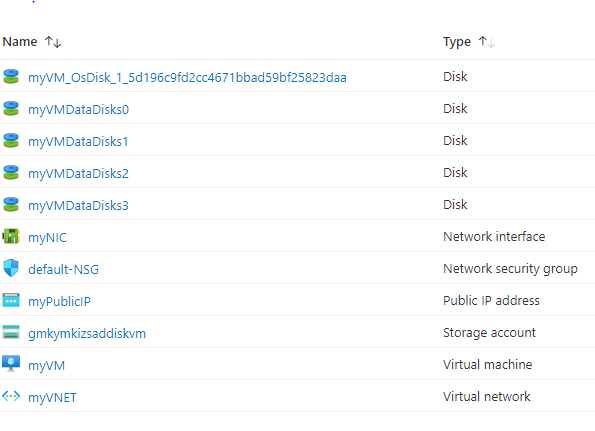

# Terraform: 101-vm-multiple-data-disk
## Create a Virtual Machine from a Windows Image with 4 Empty Data Disks
## Description

This is a conversion of ARM template *[101-vm-multiple-data-disk](https://github.com/Azure/azure-quickstart-templates/tree/master/101-vm-multiple-data-disk)* from the repository *[azure\azure-quickstart-templates](https://github.com/Azure/azure-quickstart-templates)* to Terraform configuration.

This configuration allows you to create a Windows Virtual Machine from a specified image during the template deployment and install the VM Diagnostics Extension. It also attaches 4 empty data disks. Note that you can specify the size of each of the empty data disks. This template also deploys a Storage Account, Virtual Network, Public IP addresses and a Network Interface, and it will deploy the following resources…



> ### Note:
> If the specified resource group is already exist then the script will not continue with the deployment. If you want to deploy the resources to the existing resource group, then import the resource group to state before deployment.

### Syntax
```
# To initialize the configuration directory
PS C:\Terraform\101-vm-multiple-data-disk> terraform init 

# To check the execution plan
PS C:\Terraform\101-vm-multiple-data-disk> terraform plan

# To deploy the configuration
PS C:\Terraform\101-vm-multiple-data-disk> terraform apply
``` 

### Example
```
# Initialize
PS C:\Terraform\101-vm-multiple-data-disk> terraform init 

# Plan
PS C:\Terraform\101-vm-multiple-data-disk> terraform plan -var="adminUsername=cloudguy" -var="adminPassword=Abcd@1234"

<--- output truncated --->

# Apply
PS C:\Terraform\101-vm-multiple-data-disk> terraform apply -var="adminUsername=cloudguy" -var="adminPassword=Abcd@1234"

```

### Output

```
azurerm_resource_group.arg-01: Creating...
azurerm_resource_group.arg-01: Creation complete after 1s tf-rg
azurerm_public_ip.apip-01: Creating...

<--- output truncated --->

azurerm_virtual_machine_data_disk_attachment.adattach-01[0]: Creation complete after 4m9s

Apply complete! Resources: 18 added, 0 changed, 0 destroyed.
```

> Azure Cloud Shell comes with Azure PowerShell pre-installed and you can deploy the above resources using Cloud Shell as well.
>
>[](https://shell.azure.com)
