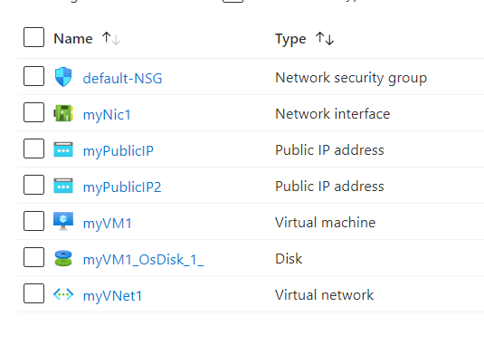

# Terraform: 101-vm-multiple-ipconfig
## Create a VM with multiple IPs
## Description 

This is a conversion of ARM template *[101-vm-multiple-ipconfig](https://github.com/Azure/azure-quickstart-templates/tree/master/101-vm-multiple-ipconfig)* from the repository *[azure\azure-quickstart-templates](https://github.com/Azure/azure-quickstart-templates)* to Terraform configuration.

This configuation allows you to deploy a simple Linux VM. It will deploy a Linux or Windows called myVM1 with 3 IP configurations: IPConfig-1, IPConfig-2 and IPConfig-3, and it will deploy the following resources...



> ### Note:
> If the specified resource group is already exist then the script will not continue with the deployment. If you want to deploy the resources to the existing resource group, then import the resource group to state before deployment.

### Syntax
```
# To initialize the configuration directory
PS C:\Terraform\101-vm-multiple-ipconfig> terraform init 

# To check the execution plan
PS C:\Terraform\101-vm-multiple-ipconfig> terraform plan

# To deploy the configuration
PS C:\Terraform\101-vm-multiple-ipconfig> terraform apply
```

### Example
```
# Initialize
PS C:\Terraform\101-vm-multiple-ipconfig> terraform init 

# Plan
PS C:\Terraform\101-vm-multiple-ipconfig> terraform plan -var="dnsLabelPrefix=testdemosep1" -var="dnsLabelPrefix1=testdemosep2" -var="OSVersion=16.04.0-LTS"

var.adminUsername
User name for the Virtual Machine.
Enter a value: demouser

var.adminPassword
The admin password of the VM.
Enter a value: *********

# Apply
PS C:\Terraform\101-vm-multiple-ipconfig> terraform apply -var="dnsLabelPrefix=testdemosep1" -var="dnsLabelPrefix1=testdemosep2" -var="OSVersion=16.04.0-LTS"

var.adminUsername
User name for the Virtual Machine.
Enter a value: demouser

var.adminPassword
The admin password of the VM.
Enter a value: *******
```

## Output
```
azurerm_public_ip.apip-01: Creating...
azurerm_virtual_network.avn-01: Creating...

<--- output truncated --->

azurerm_virtual_machine.avm-02[0]: Still creating... [1m40s elapsed]
azurerm_virtual_machine.avm-02[0]: Creation complete after 1m48s

Apply complete! Resources: 9 added, 0 changed, 0 destroyed.

Outputs:

hostname = testdemosep1.westus.cloudapp.azure.com
```

> Azure Cloud Shell comes with Azure PowerShell pre-installed and you can deploy the above resources using Cloud Shell as well.
>
>[](https://shell.azure.com)
