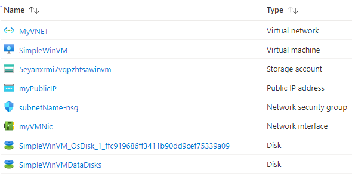

# Terraform: 101-vm-secure-password
## Very simple deployment of a Windows VM
## Description

This is a conversion of ARM template *[101-vm-secure-password](https://github.com/Azure/azure-quickstart-templates/blob/master/101-vm-secure-password/)* from the repository *[azure\azure-quickstart-templates](https://github.com/Azure/azure-quickstart-templates)* to Terraform configuration.

This configuration allows you to deploy a simple Windows VM by retrieving the password that is stored in a Key Vault. Therefore the password is never put in plain text in the template parameter file, and it will deploy the following resources…



> ### Note:
> If the specified resource group is already exist then the script will not continue with the deployment. If you want to deploy the resources to the existing resource group, then import the resource group to state before deployment.

### Syntax
```
# To initialize the configuration directory
PS C:\Terraform\101-vm-secure-password> terraform init 

# To check the execution plan
PS C:\Terraform\101-vm-secure-password> terraform plan

# To deploy the configuration
PS C:\Terraform\101-vm-secure-password> terraform apply
``` 

### Example
```
# Initialize
PS C:\Terraform\101-vm-secure-password> terraform init 

# Plan
PS C:\Terraform\101-vm-secure-password> terraform plan -var="adminUsername=cloudguy" 

<--- output truncated --->

# Apply
PS C:\Terraform\101-vm-secure-password> terraform apply -var="adminUsername=cloudguy" 

```

### Output

```
azurerm_resource_group.arg-01: Creating...
azurerm_resource_group.arg-01: Creation complete after 1s
azurerm_public_ip.apip-01: Creating...
azurerm_virtual_network.avn-01: Creating...

<--- output truncated --->

azurerm_virtual_machine_data_disk_attachment.adattach-01: Still creating... [1m0s elapsed]
azurerm_virtual_machine_data_disk_attachment.adattach-01: Creation complete after 1m2s 

Apply complete! Resources: 12 added, 0 changed, 0 destroyed.
```

> Azure Cloud Shell comes with Azure PowerShell pre-installed and you can deploy the above resources using Cloud Shell as well.
>
>[](https://shell.azure.com)
