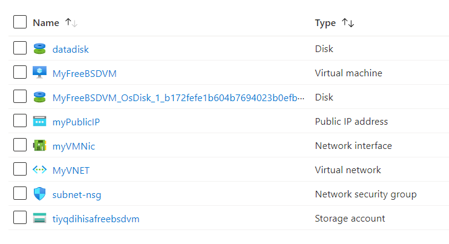

# Terraform: 101-vm-simple-freebsd
## Very simple deployment of an FreeBSD VM
## Description 

This is a conversion of ARM template *[101-vm-simple-freebsd](https://github.com/Azure/azure-quickstart-templates/tree/master/101-vm-simple-freebsd)* from the repository *[azure\azure-quickstart-templates](https://github.com/Azure/azure-quickstart-templates)* to Terraform configuration.

This configuration allows you to deploy a simple FreeBSD VM using a few different options for the FreeBSD version, using the latest patched version. This will deploy a A1 size VM in the resource group location and return the FQDN of the VM, and it will deploy the following resources…



> ### Note:
> If the specified resource group is already exist then the script will not continue with the deployment. If you want to deploy the resources to the existing resource group, then import the resource group to state before deployment.

### Syntax
```
# To initialize the configuration directory
PS C:\Terraform\101-vm-simple-freebsd> terraform init 

# To check the execution plan
PS C:\Terraform\101-vm-simple-freebsd> terraform plan

# To deploy the configuration
PS C:\Terraform\101-vm-simple-freebsd> terraform apply
``` 
### Example
```
# Initialize
PS C:\Terraform\101-vm-simple-freebsd> terraform init 

# Plan
PS C:\Terraform\101-vm-simple-freebsd> terraform plan

var.dnsLabelPrefix
Unique DNS Name for the Public IP used to access the Virtual Machine.
Enter a value: testaug

var.adminUsername
User name for the Virtual Machine.
Enter a value: demouser

var.adminPassword
The admin password of the VM.
Enter a value: *********

<--- output truncated --->

# Apply
PS C:\Terraform\101-vm-simple-freebsd> terraform apply

var.dnsLabelPrefix
Unique DNS Name for the Public IP used to access the Virtual Machine.
Enter a value: testaug

var.adminUsername
User name for the Virtual Machine.
Enter a value: demouser

var.adminPassword
The admin password of the VM.
Enter a value: *********
```

### Output
```
azurerm_storage_account.asa-01: Creating...
azurerm_storage_account.asa-01: Still creating... [10s elapsed]

<--- output truncated --->

azurerm_virtual_machine_data_disk_attachment.adattach-01: Still creating... [1m10s elapsed]
azurerm_virtual_machine_data_disk_attachment.adattach-01: Creation complete after 1m10s

Apply complete! Resources: 12 added, 0 changed, 0 destroyed.

Outputs:

hostname = testaug.westus.cloudapp.azure.com
sshCommand = demouser@testaug.westus.cloudapp.azure.com
```

> Azure Cloud Shell comes with Azure PowerShell pre-installed and you can deploy the above resources using Cloud Shell as well.
>
>[](https://shell.azure.com)
