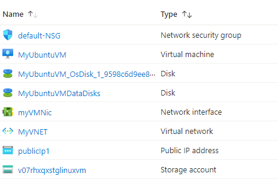

# Terraform: 101-vm-simple-linux-with-accelerated-networking

## Very simple deployment of a Linux VM with Accelerated Networking

## Description
This is an Azure quickstart sample terraform configuration based on ARM template *[101-vm-simple-linux-with-accelerated-networking](https://github.com/Azure/azure-quickstart-templates/tree/master/101-vm-simple-linux-with-accelerated-networking)* from the repository *[azure\azure-quickstart-templates](https://https://github.com/Azure/azure-quickstart-templates)* to Terraform configuration.

This configuration allows you to deploy a simple Linux VM with Accelerated Networking using Ubuntu version 16.04.0-LTS with the latest patched version. This will deploy a D3_v2 size VM in the resource group location and return the FQDN of the VM, and it will deploy the following resources...



> ### Note:
> If there is already the specified resource group exists then the script will not continue with the deployment. If you want to deploy the resources to the existing resource group, then import the resource group to state before the deployment.

### Syntax
```
# To initialize the configuration directory
PS C:\Terraform\101-vm-simple-linux-with-accelerated-networking> terraform init 

# To check the execution plan
PS C:\Terraform\101-vm-simple-linux-with-accelerated-networking> terraform plan

# To deploy the configuration
PS C:\Terraform\101-vm-simple-linux-with-accelerated-networking> terraform apply
```  

### Example
```
# Initialize
PS C:\Terraform\101-vm-simple-linux-with-accelerated-networking> terraform init 

# Plan
PS C:\Terraform\101-vm-simple-linux-with-accelerated-networking> terraform plan -var="adminUsername=Cloudguy"

var.adminPassword
Password for the Virtual Machine.
Enter a value: *********

<--- output truncated --->

# Apply
PS C:\Terraform\101-vm-simple-linux-with-accelerated-networking> terraform apply -var="adminUsername=Cloudguy"

var.adminPassword
Password for the Virtual Machine.
Enter a value: *********
```

>Assuming public key is already generated and stored in your home directory ("~/.ssh/")

### Output
```
azurerm_resource_group.arg-01: Creating...
azurerm_resource_group.arg-01: Creation complete after 1s 
azurerm_virtual_network.avn-01: Creating...

<--- output truncated --->

azurerm_virtual_machine_data_disk_attachment.adattach-01: Still creating... [1m0s elapsed]
azurerm_virtual_machine_data_disk_attachment.adattach-01: Creation complete after 1m3s 

Apply complete! Resources: 12 added, 0 changed, 0 destroyed.

Outputs:

hostname = demodnssep.westus.cloudapp.azure.com
sshCommand = ssh cloudguy@demodnssep.westus.cloudapp.azure.com

```

>Azure Cloud Shelll comes with terraform pre-installed and you deploy this configuration in Cloud Shell as well.
>
>[](https://shell.azure.com)
