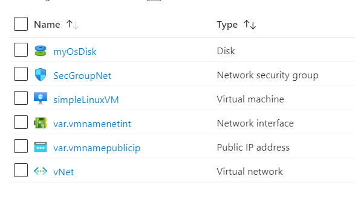

Cloud Shelll has in-built terraform libraries, deploy these configurations on Cloud Shell

[](https://shell.azure.com)
# 101-vm-simple-linux

## Very simple deployment of a Linux VM 

### Assuming public key is already generated and stored in your Home directory ("~/.ssh/")

## Description

This is a conversion of ARM template *[101-vm-simple-linux](https://github.com/Azure/azure-quickstart-templates/tree/master/101-vm-simple-linux)* from the repository *[azure\azure-quickstart-templates](https://https://github.com/Azure/azure-quickstart-templates)*  to Terraform configuration, and this script will deploy following the resources...




> ### Note:
> If there is already the specified resource group exists then the script will not continue with the deployment. 
If you want to deploy the resources to the existing resource group, import the resource group to state before deployment.


## Syntax
```
 terraform init 
 terraform plan  
 terraform apply
```

## Example

```
PS C:\Swot\TerraformProjects\Terraform\101-vm-simple-linux> terraform init

PS C:\Swot\TerraformProjects\Terraform\101-vm-simple-linux> terraform plan

PS C:\Swot\TerraformProjects\Terraform\101-vm-simple-linux> terraform apply
```

### Output
```
azurerm_linux_virtual_machine.avm-ssh-01[0]: Creating...
azurerm_linux_virtual_machine.avm-ssh-01[0]: Still creating... [10s elapsed]
azurerm_linux_virtual_machine.avm-ssh-01[0]: Still creating... [1m40s elapsed]
azurerm_linux_virtual_machine.avm-ssh-01[0]: Creation complete after 1m49s [id=/subscriptions/bb6e0205-301a-42ce-be82-1958d517e123/resourceGroups/tf-rg/providers/Microsoft.Compute/virtualMachines/simpleLinuxVM]

Apply complete! Resources: 9 added, 0 changed, 0 destroyed.

Outputs:

adminUsername = testing
hostname = simplelinuxvm-nhemg3r4nzsoifsy.westus.cloudapp.azure.com
```