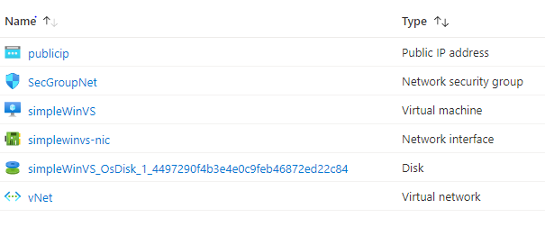

# Terraform: 101-vm-simple-windows-visualstudio2019
​
## Windows Server 2016 with Visual Studio 2019
​
## Description
This is a conversion of ARM template *[101-vm-simple-windows-visualstudio2019](https://github.com/Azure/azure-quickstart-templates/tree/master/101-vm-simple-windows-visualstudio2019)* from the repository *[azure\azure-quickstart-templates](https://https://github.com/Azure/azure-quickstart-templates)* to Terraform configuration.
​
This template deploys a Windows Server Datacenter 2016 VM with Visual Studio 2019 Community Edition, using the latest patched version. This will deploy a Standard_D2_v2 size VM in the resource group location and return the admin user name, and it will deploy the following resources...

​

​
> ### Note:
> If there is already the specified resource group exists then the script will not continue with the deployment. If you want to deploy the resources to the existing resource group, then import the resource group to state before the deployment.
​
### Syntax
```
# To initialize the configuration directory
PS C:\Terraform\101-vm-simple-windows-visualstudio2019> terraform init 
​
# To check the execution plan
PS C:\Terraform\101-vm-simple-windows-visualstudio2019> terraform plan
​
# To deploy the configuration
PS C:\Terraform\101-vm-simple-windows-visualstudio2019> terraform apply
``` 

​### Example
```
# Initialize
PS C:\Terraform\101-vm-simple-windows-visualstudio2019> terraform init 
​
# Plan
PS C:\Terraform\101-vm-simple-windows-visualstudio2019> terraform plan -var="admin_username=cloudguy" var="adminPassword=********"
​
<--- output truncated --->
​
# Apply
PS C:\Terraform\101-vm-simple-windows-visualstudio2019> terraform apply -var="admin_username=cloudguy" var="adminPassword=********"
​
<--- output truncated --->
```

### Output
```
module.AddVMtNewVnet[0].azurerm_resource_group.arg-01: Creating...
module.AddVMtNewVnet[0].azurerm_resource_group.arg-01: Creation complete after 1s 
module.AddVMtNewVnet[0].azurerm_public_ip.apip-01: Creating...
​
<--- output truncated --->
​
module.AddVMtNewVnet[0].azurerm_windows_virtual_machine.avm-01: Creation complete after 2m54s

Apply complete! Resources: 8 added, 0 changed, 0 destroyed.
​
Outputs:
​
adminUsername = cloudguy

```
​
>Azure Cloud Shelll comes with terraform pre-installed and you deploy this configuration in Cloud Shell as well.
>
>[](https://shell.azure.com)
