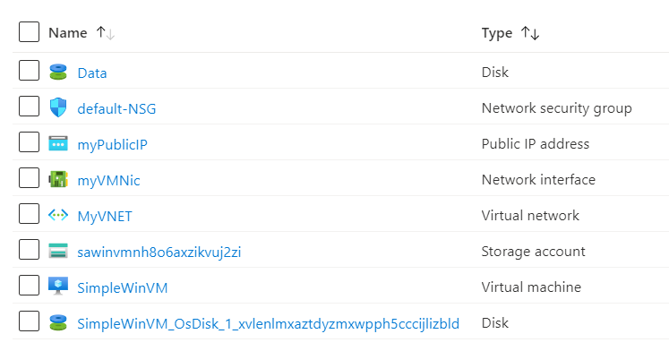

# Terraform: 101-vm-simple-windows
## Very simple deployment of a Windows VM
### Description 
This is a conversion of ARM template *[101-vm-simple-windows](https://github.com/Azure/azure-quickstart-templates/tree/master/101-vm-simple-windows)* from the repository *[azure\azure-quickstart-templates](https://github.com/Azure/azure-quickstart-templates)* to Terraform configuration, and this configuration will deploy following the resources…
 


> ### Note:
> If there is already the specified resource group exists then the script will not continue with the deployment. If you want to deploy the resources to the existing resource group, then import the resource group to state before the deployment.

### Syntax
```
# To initialize the configuration directory
PS C:\Terraform\101-vm-simple-windows> terraform init 

# To check the execution plan
PS C:\Terraform\101-vm-simple-windows> terraform plan

# To deploy the configuration
PS C:\Terraform\101-vm-simple-windows> terraform apply
```  

### Example
```
PS C:\Terraform\101-vm-simple-windows> terraform init 
PS C:\Terraform\101-vm-simple-windows> terraform plan

var.adminPassword
Password for the Virtual Machine.
Enter a value: *********

<--- output truncated --->

PS C:\Terraform\101-vm-simple-windows> terraform apply 

var.adminPassword
Password for the Virtual Machine.
Enter a value: *********
````

### Output

```
azurerm_virtual_machine.avm-01: Creating...
azurerm_virtual_machine.avm-01: Still creating... [10s elapsed]

<--- output truncated --->

azurerm_virtual_machine.avm-01: Creation complete after 2m2s 

Apply complete! Resources: 9 added, 0 changed, 0 destroyed.

Outputs:

hostname = demodns2020.westus.cloudapp.azure.com
```

>Azure Cloud Shelll comes with terraform pre-installed and you deploy this configuration in Cloud Shell as well.
>
>[](https://shell.azure.com)
