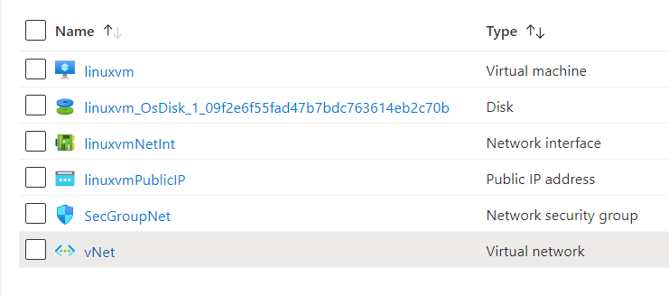

# Terraform: 101-vm-simple-zones
## Very simple deployment of a VM in an Availability Zone
## Description 
This is an Azure quickstart sample terraform configuration based on ARM template *[101-vm-simple-zones](https://github.com/Azure/azure-quickstart-templates/tree/master/101-vm-simple-zones)* from the repository *[azure\azure-quickstart-templates](https://github.com/Azure/azure-quickstart-templates)*.

This configurations allows you to deploy a simple VM (Windows or Ubuntu), using the latest patched version. This will deploy an A2_v2 size VM in the location specified and return the FQDN of the VM, and it will deploy the following resources...



> ### Note:
> If the specified resource group is already exist then the script will not continue with the deployment. If you want to deploy the resources to the existing resource group, then import the resource group to state before deployment.

### Syntax
```
# To initialize the configuration directory
PS C:\Terraform\101-vm-simple-zones> terraform init 

# To check the execution plan
PS C:\Terraform\101-vm-simple-zones> terraform plan

# To deploy the configuration
PS C:\Terraform\101-vm-simple-zones> terraform apply
```
### Example
```
# Initialize
PS C:\Terraform\101-vm-simple-zones> terraform init 

# Plan
PS C:\Terraform\101-vm-simple-zones> terraform plan

var.adminUsername
User name for the Virtual Machine.
Enter a value: demouser

var.adminPassword
The admin password of the VM.
Enter a value: *********

<--- output truncated --->

# Apply
PS C:\Terraform\101-vm-simple-zones> terraform apply

var.adminUsername
User name for the Virtual Machine.
Enter a value: demouser

var.adminPassword
The admin password of the VM.
Enter a value: *********
```
## Output
```
azurerm_resource_group.arg-01: Creating...
azurerm_virtual_network.avn-01: Creating...

<--- output truncated --->

azurerm_linux_virtual_machine.avm-01: Creation complete after 1m45s

Apply complete! Resources: 8 added, 0 changed, 0 destroyed.

Outputs:

adminUsername = demouser
hostname = linuxvm-bqrv5hqzbcwwukdh.centralus.cloudapp.azure.com
```

> Azure Cloud Shell comes with Azure PowerShell pre-installed and you can deploy the above resources using Cloud Shell as well.
>
>[](https://shell.azure.com)
