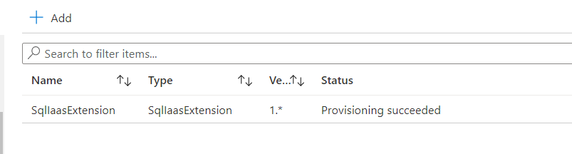

# Terraform: 101-vm-sql-existing-autobackup-update
## Configure SQL Server Automated Backup on any existing Azure virtual machine running SQL Server 2014 Enterprise and Standard.
## Description 

This is an Azure quickstart sample terraform configuration based on ARM template *[101-vm-sql-existing-autobackup-update](https://github.com/Azure/azure-quickstart-templates/tree/master/101-vm-sql-existing-autobackup-update)* from the repository *[azure\azure-quickstart-templates](https://github.com/Azure/azure-quickstart-templates)*.

This configuration can be used for any Azure virtual machine running SQL Server 2014 Enterprise or Standard Edition.The Automated Backup feature can be used to configure an automated backup schedule for SQL databases on an Azure virtual machine running SQL Server.Automated Backup is supported in your virtual machine through the SQL Server IaaS Agent extension. This extension must be installed on the VM to be able to use this feature. When you enable Automated Backup on your virtual machine, the extension will be automatically installed. This extension will also report back the latest status of this feature to you and it will deploy the following resources...



> ### Note:
> We are using data resource to fetch the details of existing virtual machine, storage to deploy the SQL Server IaaS Agent extension to that existing virtual machine. 

### Syntax
```
# To initialize the configuration directory
PS C:\Terraform\101-vm-sql-existing-autobackup-update> terraform init 

# To check the execution plan
PS C:\Terraform\101-vm-sql-existing-autobackup-update> terraform plan

# To deploy the configuration
PS C:\Terraform\101-vm-sql-existing-autobackup-update> terraform apply
```
### Example
```
# Initialize
PS C:\Terraform\101-vm-sql-existing-autobackup-update terraform init 

# Plan
PS C:\Terraform\101-vm-sql-existing-autobackup-update> terraform plan -var="existingVirtualMachineName=ExistingWinvm" -var="resourceGroupName=demo-rg" -var="sqlAutobackupStorageAccountName=cpr3bxp5yb6umstorage1"

var.sqlAutobackupEncryptionPassword
SQL Server Auto Backup Encryption Password
Enter a value: ******

<--- output truncated --->

# Apply
PS C:\Terraform\101-vm-sql-existing-autobackup-update> terraform apply  -var="existingVirtualMachineName=ExistingWinvm" -var="resourceGroupName=demo-rg" -var="sqlAutobackupStorageAccountName=cpr3bxp5yb6umstorage1"

var.sqlAutobackupEncryptionPassword
SQL Server Auto Backup Encryption Password
Enter a value: ******
```

### Output
```
data.azurerm_storage_account.asa-01: Refreshing state...
azurerm_virtual_machine_extension.avm-ext-01: Creating...

<--- output truncated --->

azurerm_virtual_machine_extension.avm-ext-01: Creation complete after 3m10s

Apply complete! Resources: 1 added, 0 changed, 0 destroyed.
```

>Azure Cloud Shelll comes with terraform pre-installed and you deploy this configuration in Cloud Shell as well.
>
>[](https://shell.azure.com)
