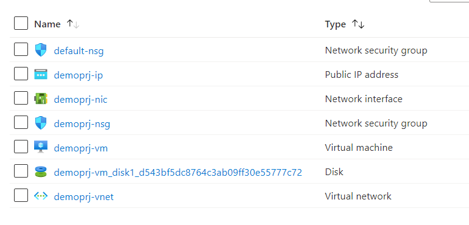

# Terraform: 101-vm-sshkey
## Deploy a Virtual Machine with SSH Keys
## Description 

This is an Azure quickstart sample terraform configuration based on ARM template *[101-vm-sshkey](https://github.com/Azure/azure-quickstart-templates/tree/master/101-vm-sshkey)* from the repository *[azure\azure-quickstart-templates](https://github.com/Azure/azure-quickstart-templates)*.

This configuration allows you to create a Linux Virtual Machine with SSH Keys. It deploys Virtual Network with an inbound rule allowing only port 22 connections, Public IP addresses, a Network Interface.The SSH rsa public key is typically generated by ssh-keygen, among other tools, on Linux, Mac, or Windows. If you already have an ~/.ssh/id_rsa.pub file, that will work directly, as you would expect. It will deploy the following resources...



> ### Note:
> If the specified resource group is already exist then the script will not continue with the deployment. If you want to deploy the resources to the existing resource group, then import the resource group to state before deployment.

### Syntax
```
# To initialize the configuration directory
PS C:\Terraform\101-vm-sshkey> terraform init 

# To check the execution plan
PS C:\Terraform\101-vm-sshkey> terraform plan

# To deploy the configuration
PS C:\Terraform\101-vm-sshkey> terraform apply
```
### Example
```
# Initialize
PS C:\Terraform\101-vm-sshkey> terraform init 

# Plan
PS C:\Terraform\101-vm-sshkey> terraform plan

var.adminUsername
User name for the Virtual Machine.
Enter a value: demouser

var.adminPublicKey
Specifies the SSH rsa public key file as a string. Use "ssh-keygen -t rsa -b 2048" to generate your SSH key pairs.
Enter a value: *********

var.projectName
Specifies a name for generating resource names.
Enter a value: demoproject

<--- output truncated --->

# Apply
PS C:\Terraform\101-vm-sshkey> terraform apply

var.adminUsername
User name for the Virtual Machine.
Enter a value: demouser

var.adminPublicKey
Specifies the SSH rsa public key file as a string. Use "ssh-keygen -t rsa -b 2048" to generate your SSH key pairs.
Enter a value: *********

var.projectName
Specifies a name for generating resource names.
Enter a value: demoproject
```
## Output
```
azurerm_resource_group.arg-01: Creating...
azurerm_public_ip.apip-01: Still creating... [10s elapsed]

<--- output truncated --->

azurerm_linux_virtual_machine.avm-01: Creation complete after 32s

Apply complete! Resources: 9 added, 0 changed, 0 destroyed.

Outputs:

adminUsername = demouser
```

> Azure Cloud Shell comes with Azure PowerShell pre-installed and you can deploy the above resources using Cloud Shell as well.
>
>[](https://shell.azure.com)
