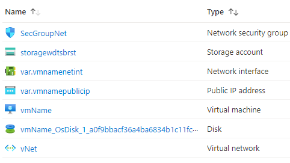

# Terraform: 101-vm-ubuntu-DSVM-GPU-or-CPU
​
## Data Science Linux Ubuntu 18.04VM 
​
## Description
This is a conversion of ARM template *[101-vm-ubuntu-DSVM-GPU-or-CPU](https://github.com/Azure/azure-quickstart-templates/tree/master/101-vm-ubuntu-DSVM-GPU-or-CPU)* from the repository *[azure\azure-quickstart-templates](https://https://github.com/Azure/azure-quickstart-templates)* to Terraform configuration.
​
This configuration deploys a Linux VM Ubuntu with data science tools. This will deploy a CPU or GPU based VM in the resource group location and will return the admin user name, Virtual Network Name, Network Security Group Name, and it will deploy the following resources...
​

​
> ### Note:
> If there is already the specified resource group exists then the script will not continue with the deployment. If you want to deploy the resources to the existing resource group, then import the resource group to state before the deployment.
​
### Syntax
```
# To initialize the configuration directory
PS C:\Terraform\101-vm-ubuntu-DSVM-GPU-or-CPU> terraform init 
​
# To check the execution plan
PS C:\Terraform\101-vm-ubuntu-DSVM-GPU-or-CPU> terraform plan
​
# To deploy the configuration
PS C:\Terraform\101-vm-ubuntu-DSVM-GPU-or-CPU> terraform apply
```  
​
### Example
```
# Initialize
PS C:\Terraform\101-vm-ubuntu-DSVM-GPU-or-CPU> terraform init 
​
# Plan
PS C:\Terraform\101-vm-ubuntu-DSVM-GPU-or-CPU> terraform plan
​
var.adminPassword
  Password for the Virtual Machine. SSH key is recommended​
  Enter a value: ********
​
var.admin_username
  Default Admin username
​  Enter a value: cloudguy

<--- output truncated --->
​
# Apply
PS C:\Terraform\101-vm-ubuntu-DSVM-GPU-or-CPU> terraform apply 
​
var.adminPassword
  Password for the Virtual Machine. SSH key is recommended
​
  Enter a value: ********
​
var.admin_username
  Default Admin username
​
  Enter a value: cloudguy
<--- output truncated --->
```
​
>Assuming public key is already generated and stored in your home directory ("~/.ssh/")
​
### Output
```
random_string.sac: Creating...
azurerm_resource_group.arg-01: Creation complete after 2s
​
<--- output truncated --->
​
azurerm_linux_virtual_machine.avm-ssh-01: Still creating... [1m30s elapsed]
azurerm_linux_virtual_machine.avm-ssh-01: Creation complete after 1m47s 
​
Apply complete! Resources: 10 added, 0 changed, 0 destroyed.
​
Outputs:
​
adminUsername = cloudguy
```
​
>Azure Cloud Shelll comes with terraform pre-installed and you deploy this configuration in Cloud Shell as well.
>
>[](https://shell.azure.com)
