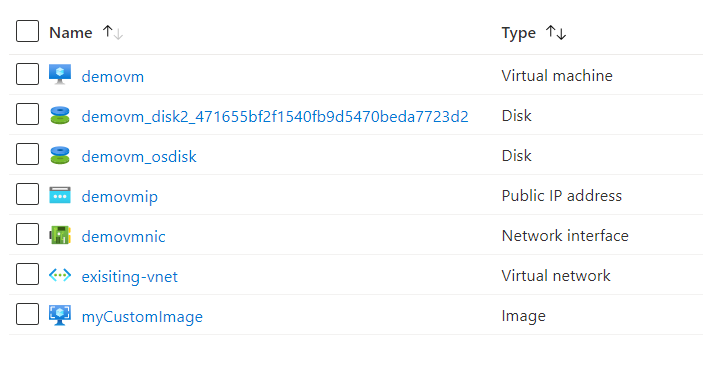

# Terraform: 101-vm-user-image-data-disks
## Create a Virtual Machine from a User Image
## Description 

This is a conversion of ARM template *[101-vm-user-image-data-disks](https://github.com/Azure/azure-quickstart-templates/tree/master/101-vm-user-image-data-disks)* from the repository *[azure\azure-quickstart-templates](https://github.com/Azure/azure-quickstart-templates)* to Terraform configuration.

Prerequisite - The VHDs to be used for OS and data disks must be stored as page blob in an Azure Resource Manager storage account.

This configutation allows you to create virtual machines from the specified VHDs for OS and data disks. The disks used for your VM will be based on copies of the VHDs you specify in the configuration parameters. It first creates a managed image using the specified OS and data VHDs. Then, it creates a VM using the managed image. And also deploys a Virtual Network, Public IP addresses and a Network Interface in a user specified resource group.



> ### Note:
> We are using data resource to fetch the details of existing virtual network and existing subnet and deploying the resources in the existing resurce group.

### Syntax
```
# To initialize the configuration directory
PS C:\Terraform\101-vm-user-image-data-disks> terraform init 

# To check the execution plan
PS C:\Terraform\101-vm-user-image-data-disks> terraform plan

# To deploy the configuration
PS C:\Terraform\101-vm-user-image-data-disks> terraform apply
```

### Example
```
# Initialize
PS C:\Terraform\101-vm-user-image-data-disks> terraform init 

# Plan with an existing vnet
PS C:\Terraform\101-vm-user-image-data-disks> terraform plan -var="existingVnetName=existing-vnet01" -var="existing-rg=test-rg" -var="vnet-new-or-existing=existing"

var.adminPassword
Password for the Virtual Machine.
Enter a value: *********

# Plan with a new vnet
PS C:\Terraform\101-vm-user-image-data-disks> terraform plan -var="vnet-new-or-existing=new"

var.adminPassword
Password for the Virtual Machine.
Enter a value: *********

# To deploy within an existing vnet
PS C:\Terraform\101-vm-user-image-data-disks> terraform apply -var="existingVnetName=existing-vnet01" -var="existing-rg=test-rg" -var="vnet-new-or-existing=existing"

var.adminPassword
Password for the Virtual Machine.
Enter a value: *********

# To deploy within a new vnet
PS C:\Terraform\101-vm-user-image-data-disks> terraform apply -var="vnet-new-or-existing=new"

var.adminPassword
Password for the Virtual Machine.
Enter a value: *********
```

### Output
```
azurerm_resource_group.arg-01: Creating...
azurerm_resource_group.arg-01: Creation complete after 3s

<--- output truncated --->

azurerm_virtual_machine.avm-01[0]: Still creating... [2m40s elapsed]
azurerm_virtual_machine.avm-01[0]: Creation complete after 4m4s


Apply complete! Resources: 10 added, 0 changed, 0 destroyed
```
>Azure Cloud Shelll comes with terraform pre-installed and you deploy this configuration in Cloud Shell as well.
>
>[](https://shell.azure.com)