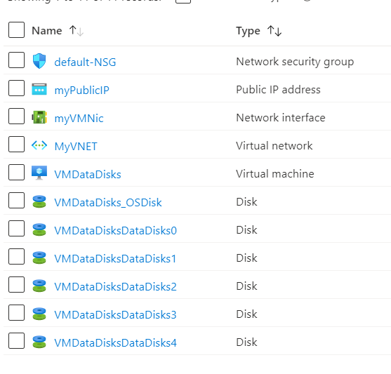

# Terraform: 101-vm-windows-copy-datadisks
## Windows VM deployment with a variable number of data disks
## Description 

This is a conversion of ARM template *[101-vm-windows-copy-datadisks](https://github.com/Azure/azure-quickstart-templates/tree/master/101-vm-windows-copy-datadisks)* from the repository *[azure\azure-quickstart-templates](https://github.com/Azure/azure-quickstart-templates)* to Terraform configuration.

This configuration allows you to deploy a simple VM and specify the number of data disks at deploy time using a parameter. Note that the number and size of data disks is bound by the VM size, this sample does not attempt to enforce those rules beyond the size used in this sample, and it will deploy the following resources...



> ### Note:
> If the specified resource group is already exist then the script will not continue with the deployment. If you want to deploy the resources to the existing resource group, then import the resource group to state before deployment.

### Syntax
```
# To initialize the configuration directory
PS C:\Terraform\101-vm-windows-copy-datadisks> terraform init 

# To check the execution plan
PS C:\Terraform\101-vm-windows-copy-datadisks> terraform plan

# To deploy the configuration
PS C:\Terraform\101-vm-windows-copy-datadisks> terraform apply
``` 

### Example
```
PS C:\Terraform\101-vm-windows-copy-datadisks> terraform init 
PS C:\Terraform\101-vm-windows-copy-datadisks> terraform plan

var.adminPassword
The admin password of the VM.
Enter a value: *********

<--- output truncated --->

PS C:\Terraform\101-vm-windows-copy-datadisks> terraform apply -var numberOfDataDisks=5

var.adminPassword
The admin password of the VM.
Enter a value: *********
```
### Output

```
azurerm_network_security_group.ansg-01: Creating...
azurerm_managed_disk.amd-01[1]: Still creating... [10s elapsed]

<--- output truncated --->

azurerm_virtual_machine_data_disk_attachment.adattach-01[1]: Creation complete after 8m36s

Apply complete! Resources: 19 added, 0 changed, 0 destroyed.

Outputs:

hostname = ddvm-lzjqvbzjculgqxpr.westus.cloudapp.azure.com
```

> Azure Cloud Shell comes with Azure PowerShell pre-installed and you can deploy the above resources using Cloud Shell as well.
>
>[](https://shell.azure.com)