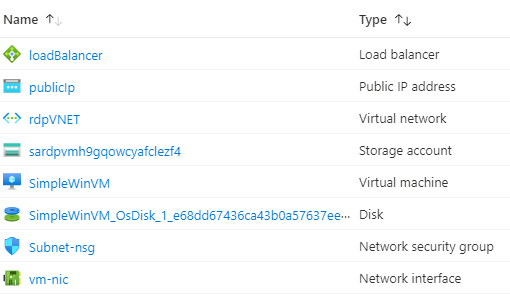

# Terraform: 101-vm-with-rdp-port

## Create a VM with an RDP port

## Description
This is a conversion of ARM template *[101-vm-with-rdp-port](https://github.com/Azure/azure-quickstart-templates/tree/master/101-vm-with-rdp-port)* from the repository *[azure\azure-quickstart-templates](https://github.com/Azure/azure-quickstart-templates)* to Terraform configuration.

This configuration demonstrates how to create a NAT rule in loadbalancer to allow RDP to a vm, and it will deploy the following resources...



> ### Note:
> If there is already the specified resource group exists then the script will not continue with the deployment. If you want to deploy the resources to the existing resource group, then import the resource group to state before deployment.

### Syntax
```
# To initialize the configuration directory
PS C:\Terraform\101-vm-with-rdp-port> terraform init 

# To check the execution plan
PS C:\Terraform\101-vm-with-rdp-port> terraform plan

# To deploy the configuration
PS C:\Terraform\101-vm-with-rdp-port> terraform apply
```  

### Example
```
# Initialize
PS C:\Terraform\101-vm-with-rdp-port> terraform init 

# Plan
PS C:\Terraform\101-vm-with-rdp-port> terraform plan
var.adminPassword
  The password for the administrator account of the new VM

  Enter a value: *********

var.dnsLabelPrefix
  Unique public DNS prefix for the deployment. The fqdn will look something like '<dnsname>.westus.cloudapp.azure.com'. Up to 62 chars, digits or dashes, lowercase, should start with a letter: must conform to '^[a-z][a-z0-9-]{1,61}[a-z0-9]$'.

  Enter a value: demodns

<--- output truncated --->

# Apply
PS C:\Terraform\101-vm-with-rdp-port> terraform apply
var.adminPassword
  The password for the administrator account of the new VM

  Enter a value: *********

var.dnsLabelPrefix
  Unique public DNS prefix for the deployment. The fqdn will look something like '<dnsname>.westus.cloudapp.azure.com'. Up to 62 chars, digits or dashes, lowercase, should start with a letter: must conform to '^[a-z][a-z0-9-]{1,61}[a-z0-9]$'.

  Enter a value: demodns 
  
  <--- output truncated --->
```

### Output
```
random_string.asaname-01: Creating...
random_string.asaname-01: Creation complete after 0s 
azurerm_resource_group.arg-01: Creating...
azurerm_resource_group.arg-01: Creation complete after 1s

<--- output truncated --->

azurerm_windows_virtual_machine.avm-01: Still creating... [4m50s elapsed]
azurerm_windows_virtual_machine.avm-01: Creation complete after 4m54s 

Apply complete! Resources: 15 added, 0 changed, 0 destroyed.

Outputs:

Connectionstring = mstsc.exe /v:demodns.westus.cloudapp.azure.com:50001
```

>Azure Cloud Shelll comes with terraform pre-installed and you deploy this configuration in Cloud Shell as well.
>
>[](https://shell.azure.com)
