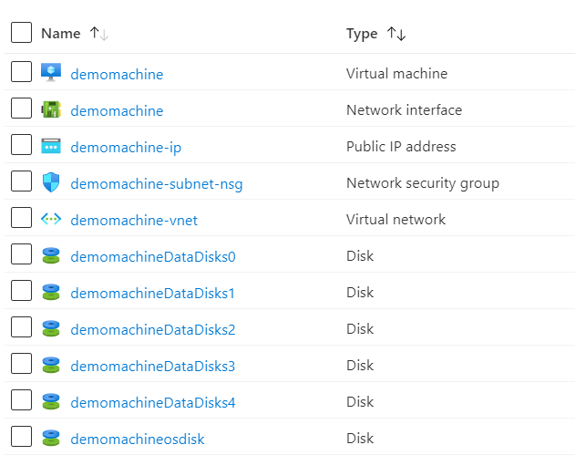

# Terraform: 101-vm-with-standardssd-disk
## Create a Virtual Machine from a Windows Image with multiple empty Standard SSD Data Disks
## Description

This is a conversion of ARM template *[101-vm-with-standardssd-disk](https://github.com/Azure/azure-quickstart-templates/tree/master/101-vm-with-standardssd-disk)* from the repository *[azure\azure-quickstart-templates](https://github.com/Azure/azure-quickstart-templates)* to Terraform configuration.

This configuration allows you to create a Windows Virtual Machine from a specified image during the template deployment. It also attaches multiple empty Standard SSD data disks. Note that you can specify the size of each of the empty data disks. It also deploys a Virtual Network, Public IP addresses and a Network Interface.
It will deploy the following resources…



> ### Note:
> If the specified resource group is already exist then the script will not continue with the deployment. If you want to deploy the resources to the existing resource group, then import the resource group to state before deployment.

### Syntax
```
# To initialize the configuration directory
PS C:\Terraform\101-vm-with-standardssd-disk> terraform init 

# To check the execution plan
PS C:\Terraform\101-vm-with-standardssd-disk> terraform plan

# To deploy the configuration
PS C:\Terraform\101-vm-with-standardssd-disk> terraform apply
``` 

### Example
```
PS C:\Terraform\101-vm-with-standardssd-disk> terraform init 
PS C:\Terraform\101-vm-with-standardssd-disk> terraform plan

var.adminUsername
The admin user name of the VM.
Enter a value: *********

var.adminPassword
The admin password of the VM.
Enter a value: *********

<--- output truncated --->

PS C:\Terraform\101-vm-with-standardssd-disk> terraform apply 

var.adminUsername
The admin user name of the VM.
Enter a value: *********

var.adminPassword
The admin password of the VM.
Enter a value: *********
```

### Output

```
azurerm_virtual_network.avn-01: Creating...
azurerm_virtual_network.avn-01: Still creating... [10s elapsed]

<--- output truncated --->

azurerm_virtual_machine_data_disk_attachment.adattach-01[0]: Creation complete after 4m37s

Apply complete! Resources: 18 added, 0 changed, 0 destroyed.
```

> Azure Cloud Shell comes with Azure PowerShell pre-installed and you can deploy the above resources using Cloud Shell as well.
>
>[](https://shell.azure.com)