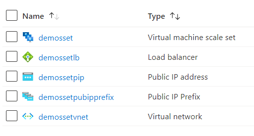

# Terraform: 101-vmms-with-public-ip-prefix
## VMSS with Public IP Prefix
## Description 

This is a conversion of ARM template *[101-vmms-with-public-ip-prefix](https://github.com/Azure/azure-quickstart-templates/tree/master/101-vmms-with-public-ip-prefix)* from the repository *[azure\azure-quickstart-templates](https://github.com/Azure/azure-quickstart-templates)* to Terraform configuration.

This configuration deploys a Virtual Machine Scale Set with Public IP Prefix, and it will deploy the following resources...



> ### Note:
> If the specified resource group is already exist then the script will not continue with the deployment. If you want to deploy the resources to the existing resource group, then import the resource group to state before deployment.

### Syntax
```
# To initialize the configuration directory
PS C:\Terraform\101-vmms-with-public-ip-prefix> terraform init 

# To check the execution plan
PS C:\Terraform\101-vmms-with-public-ip-prefix> terraform plan

# To deploy the configuration
PS C:\Terraform\101-vmms-with-public-ip-prefix> terraform apply
```
### Example
```
# Initialize
PS C:\Terraform\101-vmms-with-public-ip-prefix> terraform init 

# Plan
PS C:\Terraform\101-vmms-with-public-ip-prefix> terraform plan

var.adminPasswordOrKey
SSH Key or password for the Virtual Machine. SSH key is recommended.
Enter a value: ******

var.adminUsername
Admin username on all VMs
Enter a value: demouser

var.vmssName
String used as a base for naming resources (9 characters or less). A hash is prepended to this string for some resources, and resource-specific information is appended.
Enter a value: demoset

<--- output truncated --->

# Apply
PS C:\Terraform\101-vmms-with-public-ip-prefix> terraform apply

var.adminPasswordOrKey
SSH Key or password for the Virtual Machine. SSH key is recommended.
Enter a value: ******

var.adminUsername
Admin username on all VMs
Enter a value: demouser

var.vmssName
String used as a base for naming resources (9 characters or less). A hash is prepended to this string for some resources, and resource-specific information is appended.
Enter a value: demosset
```
## Output
```
azurerm_resource_group.arg-01: Creating...
azurerm_virtual_network.avn-01: Creating...

<--- output truncated --->

azurerm_linux_virtual_machine_scale_set.avmss-01: Still creating... [1m10s elapsed]
azurerm_linux_virtual_machine_scale_set.avmss-01: Creation complete after 1m12s

Apply complete! Resources: 9 added, 0 changed, 0 destroyed.
```

> Azure Cloud Shell comes with Azure PowerShell pre-installed and you can deploy the above resources using Cloud Shell as well.
>
>[](https://shell.azure.com)