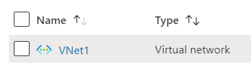

# Terraform: 101-vnet-two-subnets 

## Virtual Network with two Subnets

## Description
This is a conversion of ARM template *[101-vnet-two-subnets](https://github.com/Azure/azure-quickstart-templates/tree/master/101-vnet-two-subnets)* from the repository *[azure\azure-quickstart-templates](https://github.com/Azure/azure-quickstart-templates)* to Terraform configuration.

This configuration allows you to create a Virtual Network with two subnets, and it will deploy the following resources…

### Virtual Networks
  
    
### Subnets
 

> ### Note:
> If there is already the specified resource group exists then the script will not continue with the deployment. If you want to deploy the resources to the existing resource group, then import the resource group to state before deployment

### Syntax
```
# To initialize the configuration directory
PS C:\Terraform\101-vnet-two-subnets> terraform init 

# To check the execution plan
PS C:\Terraform\101-vnet-two-subnets> terraform plan

# To deploy the configuration
PS C:\Terraform\101-vnet-two-subnets> terraform apply
``` 

### Example
```
# Initialize
PS C:\Terraform\101-vnet-two-subnets> terraform init

# Plan
PS C:\Terraform\101-vnet-two-subnets> terraform plan

# Apply
PS C:\Terraform\101-vnet-two-subnets> terraform apply 
```

### Output
```
azurerm_resource_group.arg-01: Creating...

<--- output truncated --->

azurerm_subnet.as-01: Creation complete after 10s
Apply complete! Resources: 4 added, 0 changed, 0 destroyed.
```

>Azure Cloud Shelll comes with terraform pre-installed and you deploy this configuration in Cloud Shell as well.
>
>[](https://shell.azure.com)