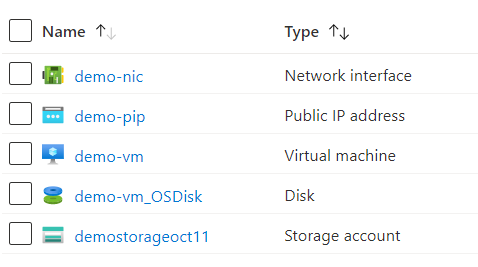

# Terraform: 201-vm-different-rg-vnet
## Create a VM in a VNET in a different Resource Group.
## Description 

This is an Azure quickstart sample terraform configuration based on ARM template *[201-vm-different-rg-vnet](https://github.com/Azure/azure-quickstart-templates/tree/master/201-vm-different-rg-vnet)* from the repository *[azure\azure-quickstart-templates](https://github.com/Azure/azure-quickstart-templates)*.

This configuration creates a VM in a VNET which is in a different Resource Group. Please ensure you have already deployed the prerequisite *[preq](https://github.com/kpatnayakuni/azure-quickstart-terraform-configuration/tree/master/201-vm-different-rg-vnet/preq)* and pass the VNET name and its resource group name as input to this parameter. It will deploy the following resources..



> ### Note:
> We are using data resource to fetch the details of existing virtual network, subnet and resource group.

### Syntax
```
# To initialize the configuration directory
PS C:\Terraform\201-vm-different-rg-vnet> terraform init 

# To check the execution plan
PS C:\Terraform\201-vm-different-rg-vnet> terraform plan

# To deploy the configuration
PS C:\Terraform\201-vm-different-rg-vnet> terraform apply
```
### Example
```
# Initialize
PS C:\Terraform\201-vm-different-rg-vnet> terraform init 

# Plan
PS C:\Terraform\201-vm-different-rg-vnet> terraform plan -var="newStorageAccountName=demostorageoct11" -var="publicIPName=demo-pip" -var="vmName=demo-vm" -var="adminUsername=demouser" -var="virtualNetworkName=existing-vnet" -var="virtualNetworkResourceGroup=pre-rg" -var="subnet1Name=existing-subnet-1" -var="nicName=demo-nic"

var.adminPassword
SSH Key or password for the Virtual Machine. SSH key is recommended.
Enter a value: ******

<--- output truncated --->

# Apply
PS C:\Terraform\201-vm-different-rg-vnet> terraform apply -var="newStorageAccountName=demostorageoct11" -var="publicIPName=demo-pip" -var="vmName=demo-vm" -var="adminUsername=demouser" -var="virtualNetworkName=existing-vnet" -var="virtualNetworkResourceGroup=pre-rg" -var="subnet1Name=existing-subnet-1" -var="nicName=demo-nic"

var.adminPassword
SSH Key or password for the Virtual Machine. SSH key is recommended.
Enter a value: ******
```
### Output
```
azurerm_resource_group.arg-01: Creating...
data.azurerm_resource_group.arg-ex-01: Refreshing state... 

<--- output truncated --->

azurerm_linux_virtual_machine.avm-ssh-01: Creation complete after 1m51s

Apply complete! Resources: 5 added, 0 changed, 0 destroyed.
```

>Azure Cloud Shelll comes with terraform pre-installed and you deploy this configuration in Cloud Shell as well.
>
>[](https://shell.azure.com)
